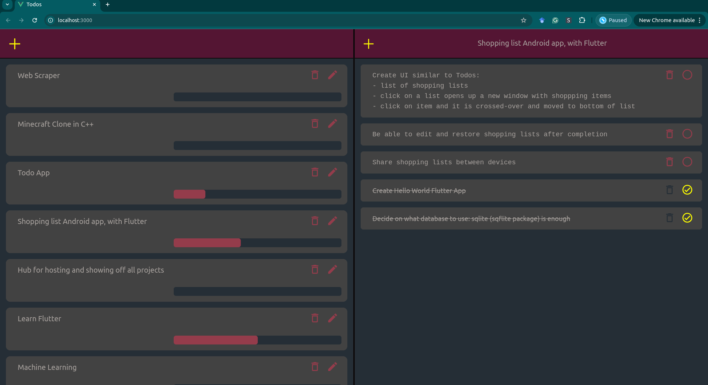

# TODO Application

This is a simple TODO-application craeted with Node.js, MongoDB, Vite, Vue 3, Tailwind.

The purpose of the application is to track progress of TODO:s.



**Only tested with Ubuntu**


# Installation
Dependencies have to be installed manually. E.g. for Ubuntu:
```
sudo snap install docker
```


# Launch
To launch the application run the script:
```
./tool/launch.sh
```

the script will start a Google Chrome instance. The application is the terminated by closing all the Google Chrome tabs.

For this to work make sure Google Chrome is installed and no instance of Google Chrome is running before lanching this application.
